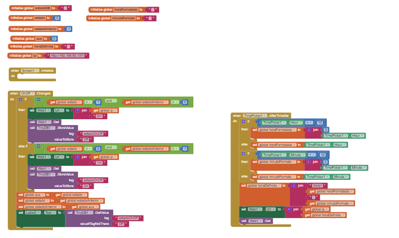
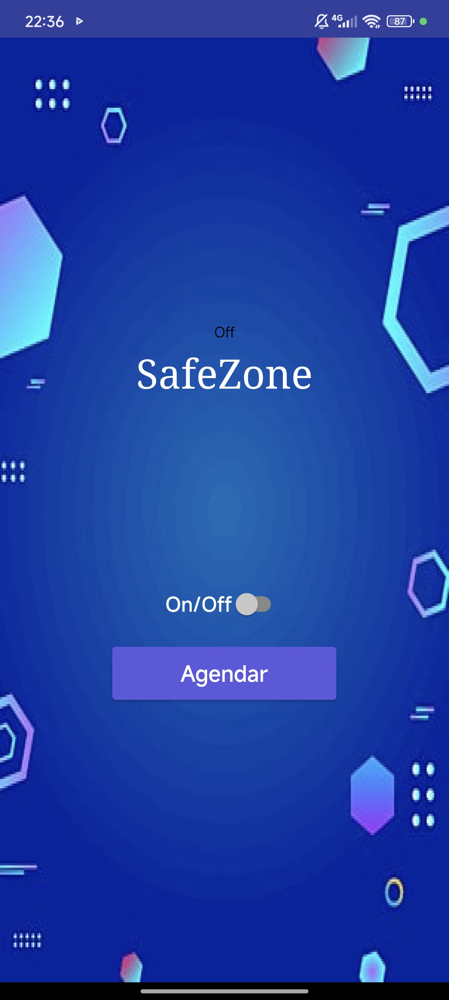

<h1 align="center">SafeZone</h1>

    Este repositório contém o código e a documentação do sistema de alarme residencial desenvolvido para a disciplina de Microcontroladores. O sistema monitora portas e janelas utilizando um sensor magnético <strong>MC-38</strong> e conta com sinalização por LED RGB e buzzer, além de controle remoto via aplicativo desenvolvido no <strong>App Inventor</strong>.

<h2>🛠️ Funcionalidades</h2>

<ul>
    <li><strong>Sensor de Porta/Janela (MC-38)</strong>: Detecta quando a porta está aberta ou fechada.</li>
    <li><strong>LED RGB</strong>:
        <ul>
            <li><strong>Verde</strong>: Porta fechada, alarme ativado.</li>
            <li><strong>Vermelho</strong>: Alarme disparado.</li>
            <li><strong>Azul</strong>: Alarme desativado pelo usuário.</li>
        </ul>
    </li>
    <li><strong>Buzzer</strong>: Emite som quando o alarme é disparado.</li>
    <li><strong>Aplicativo (App Inventor)</strong>:
        <ul>
            <li>Ativar e desativar o alarme remotamente.</li>
            <li>Agendar horário para ativar automaticamente.</li>
        </ul>
    </li>
</ul>

<h2>⚙️ Componentes Utilizados</h2>

<ul>
    <li><strong>Microcontrolador</strong>: ESP32</li>
    <li><strong>Sensor Magnético</strong>: MC-38</li>
    <li><strong>LED RGB</strong>: Indicação do estado do sistema.</li>
    <li><strong>Buzzer</strong>: Alerta sonoro quando o alarme é disparado.</li>
    <li><strong>Wi-Fi</strong>: Comunicação com o aplicativo.</li>
</ul>

<h2>📚 Bibliotecas Utilizadas</h2>

<ul>
    <li><strong>WiFi.h</strong>: Para conectar o ESP32 à rede Wi-Fi.</li>
    <li><strong>NTPClient.h</strong>: Para sincronizar a hora com um servidor NTP (Network Time Protocol).</li> 
</ul>

<h2>📱 Aplicativo</h2>

O aplicativo foi desenvolvido no <a href="https://appinventor.mit.edu/">App Inventor</a> e permite o controle remoto do sistema de alarme:

<ul>
    <li><strong>Ativar/Desativar Alarme</strong>: Controle o estado do sistema manualmente.</li>
    <li><strong>Agendamento</strong>: Defina horários para ativar o alarme automaticamente.</li>
</ul>

<strong>Nota:</strong> O App Inventor tem uma limitação: não é possível salvar o estado do botão ao reiniciar o aplicativo. Isso significa que, se o app for reiniciado, o usuário precisará selecionar o botão duas vezes para desativar o alarme.
